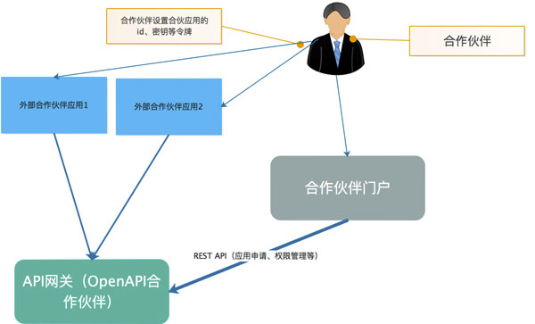
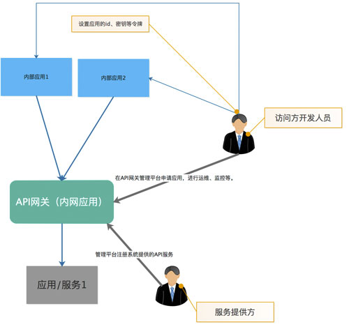

## SpringCloud 微服务搭建 - 网关（动态配置）

 

### 网关作用

网关的作用，可以实现负载均衡、路由转发、日志、权限控制、监控等。

### 网关与过滤器区别

- 网关是拦截所有服务器请求进行控制
- 过滤器拦截某单个服务器请求进行控制

### Nginx与Zuul的区别

- Nginx是采用服务器负载均衡进行转发
- Zuul依赖Ribbon和eureka实现本地负载均衡转发

相对来说Nginx功能比Zuul功能更加强大，能够整合其他语言比如lua脚本实现强大的功能，同时Nginx可以更好的抗高并发，Zuul网关适用于请求过滤和拦截等。

### 网关分类

#### 开放Api

开放api(openApi) 企业需要将自身数据、能力等作为开发平台向外开放，通常会以rest的方式向外提供，最好的例子就是淘宝开放平台、腾讯公司的QQ开发平台、微信开放平台。 Open API开放平台必然涉及到客户应用的接入、API权限的管理、调用次数管理等，必然会有一个统一的入口进行管理，这正是API网关可以发挥作用的时候。

#### 微服务网关

微服务的概念最早在2012年提出，在Martin Fowler的大力推广下，微服务在2014年后得到了大力发展。 在微服务架构中，有一个组件可以说是必不可少的，那就是微服务网关，微服务网关处理了负载均衡，缓存，路由，访问控制，服务代理，监控，日志等。API网关在微服务架构中正是以微服务网关的身份存在。 

#### API服务管理平台

上述的微服务架构对企业来说有可能实施上是困难的，企业有很多遗留系统，要全部抽取为微服务器改动太大，对企业来说成本太高。但是由于不同系统间存在大量的API服务互相调用，因此需要对系统间服务调用进行管理，清晰地看到各系统调用关系，对系统间调用进行监控等。 API网关可以解决这些问题，我们可以认为如果没有大规模的实施微服务架构，那么对企业来说微服务网关就是企业的API服务管理平台。

### 网关设计

#### 开放API接口

对于OpenAPI使用的API网关来说，一般合作伙伴要以应用的形式接入到OpenAPI平台，合作伙伴需要到 OpenAPI平台申请应用。 因此在OpenAPI网关之外，需要有一个面向合作伙伴的使用的平台用于合作伙伴，这就要求OpenAPI网关需要提供API给这个用户平台进行访问。 如下架构:

 
当然如果是在简单的场景下，可能并不需要提供一个面向合作伙伴的门户，只需要由公司的运营人员直接添加合作伙伴应用id/密钥等，这种情况下也就不需要合作伙伴门户子系统。 

#### 内网API接口
对于内网的API网关，在起到的作用上来说可以认为是微服务网关，也可以认为是内网的API服务治理平台。 当企业将所有的应用使用微服务的架构管理起来，那么API网关就起到了微服务网关的作用。 而当企业只是将系统与系统之间的调用使用rest api的方式进行访问时使用API网关对调用进行管理，那么API网关起到的就是API服务治理的作用。 架构参考如下：

对于公司内部公网应用（如APP、公司的网站），如果管理上比较细致，在架构上是可能由独立的API网关来处理这部分内部公网应用，如果想比较简单的处理，也可以是使用面向合作伙伴的API网关。 如果使用独立的API网关，有以下的好处：

- 面向合作伙伴和面向公司主体业务的优先级不一样，不同的API网关可以做到业务影响的隔离。
- 内部API使用的管理流程和面向合作伙伴的管理流程可能不一样。
- 内部的API在功能扩展等方面的需求一般会大于OpenAPI对于功能的要求。

基于以上的分析，如果公司有能力，那么还是建议分开使用合作伙伴OPEN API网关和内部公网应用网关。

### 网关框架

- Kong kong是基于Nginx+Lua进行二次开发的方案， https://konghq.com/
- Netflix Zuul，zuul是spring cloud的一个推荐组件，https://github.com/Netflix/zuul
- orange，这个开源程序是国人开发的， http://orange.sumory.com/
